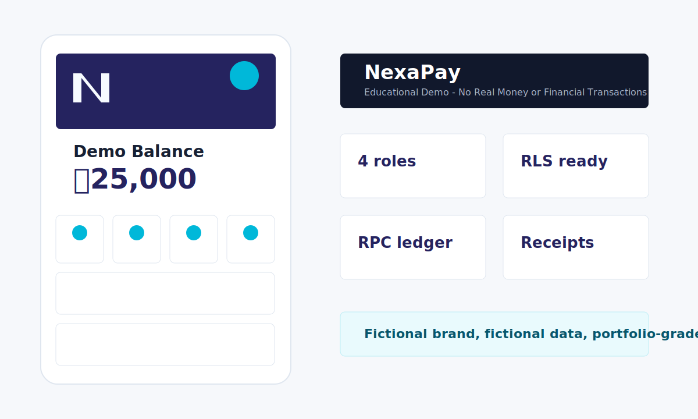

# NexaPay



NexaPay is a portfolio-grade **Mobile Financial Service Simulator** built with HTML, CSS, vanilla JavaScript, Supabase Auth, and PostgreSQL.

**Educational Demo - No Real Money or Financial Transactions**

NexaPay is an educational financial-service simulator. It is not affiliated with bKash or any real financial institution. It does not process real money, connect to real banks, collect real OTP codes, or use payment gateways.

## Features

- Customer wallet dashboard with demo balance, quick actions, favorites, notifications, transaction history, and receipts.
- Simulated Send Money, Request Money, Merchant Payment, QR Payment, Add Money, Cash Out, Recharge, Bills, Bank Transfer, Savings, and Donation flows.
- Secure Send Money RPC flow with account validation, wallet locking, fees, idempotency, notifications, and audit logs.
- Receive Money and Request Money flows with safe internal QR/link, pending requests, accept, decline, and cancel.
- Merchant Payment and QR simulation with merchant search, safe QR payloads, confirmation, receipts, and RPC balance updates.
- Add Demo Money and Cash Out simulation with fictional sources, registered-agent search, fee review, idempotency, limits, and secure RPC balance updates.
- Mobile Recharge, Bill Payment, and Demo Bank Transfer simulations with fictional providers, multi-step review, receipts, idempotency, and secure RPC deductions.
- Savings goals and donation simulation with progress tracking, deposits, withdrawals, fictional organizations, receipts, and secure RPC movement logic.
- Transaction history with search, filters, status indicators, money-in/money-out views, details, printable receipts, and downloadable demo receipt text.
- Notification center with read/unread state, mark-all-read, deletion, recent contacts, favorite contacts, and safe demo directory search.
- Merchant dashboard with protected merchant access, demo balance, payment statistics, payment search, receipts, profile management, and safe internal QR generation.
- Agent dashboard with protected agent access, demo balance, customer search, cash-in/cash-out simulation, daily statistics, history, receipts, and audit records.
- Desktop admin dashboard with overview analytics, user status controls, merchant/agent management, transaction search, service content management, announcements, promotions, audit logs, and system settings.
- Phase 18 security hardening with complete rerunnable RLS policies, audited admin RPCs, direct balance-edit blocking, storage bucket policies, and sensitive local-data scrubbing.
- Phase 19 regression testing with syntax checks, role-flow coverage, transaction validation checks, responsive route checks, and a local preview server.
- Phase 20 GitHub upload preparation with expanded `.gitignore`, safe `.env.example`, `SECURITY.md`, `.gitattributes`, and exact Windows Git commands.
- Phase 21 free deployment preparation with GitHub Pages files, static 404 fallback, Supabase production URL guidance, and deployment troubleshooting.
- Local browser demo mode using `localStorage` so beginners can run it immediately.
- Supabase Auth integration with session persistence, password recovery, and automatic demo profile/wallet creation.
- Supabase-ready database schema, RLS policies, seed data, and secure RPC transaction functions.

## Tech Stack

- Frontend: HTML5, CSS3, vanilla JavaScript
- Backend: Supabase
- Database: PostgreSQL
- Auth: Supabase Auth
- Deployment: Cloudflare Pages or GitHub Pages

## Quick Start On Windows 11

```powershell
cd C:\Users\User\Documents\Codex\2026-07-08\act-as-a-senior-full-stack-2\outputs\nexapay
node tools\local-preview-server.mjs . 5173
```

Open:

```text
http://localhost:5173
```

Use the demo role buttons on the login page to explore Customer, Merchant, Agent, and Admin screens.

## Testing

Run all Phase 10 through Phase 21 smoke and regression tests:

```powershell
cd C:\Users\User\Documents\Codex\2026-07-08\act-as-a-senior-full-stack-2\outputs\nexapay
Get-ChildItem -Path tests -Filter phase*.mjs | Sort-Object Name | ForEach-Object { node $_.FullName }
```

See `docs/phase-19-testing-bug-fixing.md`, `docs/phase-20-github-upload-preparation.md`, and `docs/phase-21-free-deployment.md` for the full testing checklist.

## GitHub Upload

Before uploading, confirm `.env` files, service-role keys, database passwords, and real credentials are not committed.

New repository:

```powershell
cd C:\Users\User\Documents\Codex\2026-07-08\act-as-a-senior-full-stack-2\outputs\nexapay
git init
git branch -M main
git add .
git commit -m "Prepare NexaPay educational wallet simulator"
git remote add origin https://github.com/YOUR-USERNAME/nexapay.git
git push -u origin main
```

Existing repository:

```powershell
cd C:\Users\User\Documents\Codex\2026-07-08\act-as-a-senior-full-stack-2\outputs\nexapay
git status
git add .
git commit -m "Complete Phase 20 GitHub upload preparation"
git pull --rebase origin main
git push origin main
```

See `docs/phase-20-github-upload-preparation.md` for the full upload checklist and common fixes.

## Supabase Setup

1. Go to [Supabase](https://supabase.com), create a free project, and wait for the project to finish provisioning.
2. Open **SQL Editor**.
3. For Phase 5 and Phase 6, run these files in order:
   - `supabase/migrations/001_schema.sql`
   - `supabase/seed.sql`
   - `supabase/migrations/004_auth_integration.sql`
4. For Phase 7 secure transaction logic, run:
   - `supabase/migrations/002_rpc_functions.sql`
   - Rerun this file after Phase 17 so the admin RPC functions are installed.
5. For Row Level Security, run:
   - `supabase/migrations/003_rls_policies.sql`
   - Rerun this file after Phase 18 so the complete hardened policies and storage rules are installed.
6. Optional: create fictional Auth users in **Authentication > Users**, then run `supabase/demo-seed-after-auth.sql`.
7. Open **Project Settings > API**.
8. Copy the Project URL and public anon key.
9. Paste them into `js/config/supabase.js`.

Never paste a service-role key into frontend code.

## Architecture

The app has two learning layers:

- Local demo mode: works immediately with fictional data stored in the browser.
- Supabase mode: uses Auth, Postgres tables, RLS, and RPC functions for secure wallet operations.

Frontend JavaScript never directly updates wallet balances in the Supabase design. Balance-changing actions must call RPC functions such as `transfer_demo_money`, `add_demo_money`, `cash_out_demo_money`, `agent_cash_in_demo_money`, `agent_cash_out_demo_money`, `move_savings_goal_money`, or `service_payment`.

Admin write actions that affect platform content use audited RPC functions such as `admin_set_profile_status`, `assign_demo_role`, `admin_save_managed_item`, `admin_save_promotion`, `admin_create_announcement`, and `admin_update_system_setting`.

## Database

Main tables:

- `profiles`
- `wallets`
- `transactions`
- `money_requests`
- `favorites`
- `merchants`
- `agents`
- `service_categories`
- `recharge_operators`
- `bill_categories`
- `bill_providers`
- `banks`
- `donation_organizations`
- `savings_goals`
- `notifications`
- `promotions`
- `system_settings`
- `audit_logs`

See `docs/database-schema.md` for details.

## Security Design

- RLS is enabled on application tables.
- Anonymous direct table access is revoked.
- Users can only read their own wallet.
- Users cannot directly update wallet balances.
- Users can view only related transactions.
- Admin access is enforced by the database role check, not by hidden UI buttons.
- Transaction RPC functions validate amount, account status, balance, idempotency, and rollback on failure.
- Private Supabase Storage bucket policies are prepared for profile images and merchant logos.

See `docs/security.md` for the full review.

See `SECURITY.md` for public repository security guidance.

## Phase Guides

- [Phase 2 - Folder Structure And Design System](./docs/phase-02-design-system.md)
- [Phase 3 - Authentication Pages](./docs/phase-03-authentication-pages.md)
- [Phase 4 - Customer Dashboard UI](./docs/phase-04-customer-dashboard.md)
- [Phase 5 - Supabase Project And Database Schema](./docs/phase-05-supabase-database-schema.md)
- [Phase 6 - Authentication Integration And Automatic Profile/Wallet Creation](./docs/phase-06-authentication-integration.md)
- [Phase 7 - Secure Send Money System](./docs/phase-07-secure-send-money.md)
- [Phase 8 - Receive Money And Request Money](./docs/phase-08-receive-request-money.md)
- [Phase 9 - Merchant Payment And QR Simulation](./docs/phase-09-merchant-payment-qr.md)
- [Phase 10 - Add Money And Cash Out Simulation](./docs/phase-10-add-money-cash-out.md)
- [Phase 11 - Mobile Recharge, Bill Payment, And Bank Transfer Simulation](./docs/phase-11-recharge-bills-bank-transfer.md)
- [Phase 12 - Savings And Donation Features](./docs/phase-12-savings-donation.md)
- [Phase 13 - Transaction History And Receipts](./docs/phase-13-transaction-history-receipts.md)
- [Phase 14 - Notifications And Favorites](./docs/phase-14-notifications-favorites.md)
- [Phase 15 - Merchant Dashboard](./docs/phase-15-merchant-dashboard.md)
- [Phase 16 - Agent Dashboard](./docs/phase-16-agent-dashboard.md)
- [Phase 17 - Admin Dashboard](./docs/phase-17-admin-dashboard.md)
- [Phase 18 - Security Review And RLS](./docs/phase-18-security-review-rls.md)
- [Phase 19 - Testing And Bug Fixing](./docs/phase-19-testing-bug-fixing.md)
- [Phase 20 - GitHub Upload Preparation](./docs/phase-20-github-upload-preparation.md)
- [Phase 21 - Free Deployment](./docs/phase-21-free-deployment.md)

## Deployment

Recommended: GitHub Pages.

1. Push this folder to a GitHub repository.
2. Open **Repository Settings > Pages**.
3. Choose **Deploy from a branch**.
4. Choose branch `main`.
5. Choose folder `/ (root)`.
6. Save and wait for the public URL.

Expected project URL:

```text
https://YOUR-USERNAME.github.io/nexapay/
```

For Supabase production mode, add this deployed URL under **Authentication > URL Configuration**:

```text
https://YOUR-USERNAME.github.io/nexapay/
https://YOUR-USERNAME.github.io/nexapay/login.html
https://YOUR-USERNAME.github.io/nexapay/reset-password.html
```

Cloudflare Pages:

1. Open Cloudflare Dashboard.
2. Go to **Workers & Pages > Create > Pages**.
3. Connect the GitHub repository.
4. Set build command to blank.
5. Set output directory to `/`.
6. Deploy.

See `docs/phase-21-free-deployment.md` for the complete deployment checklist and troubleshooting guide.

## Future Improvements

- Replace the remaining local demo transaction services with full Supabase RPC calls.
- Add real QR generation library for scannable demo QR codes.
- Add exportable admin reports.
- Add Playwright end-to-end tests.
- Add Supabase Storage profile image upload.

## License

MIT
