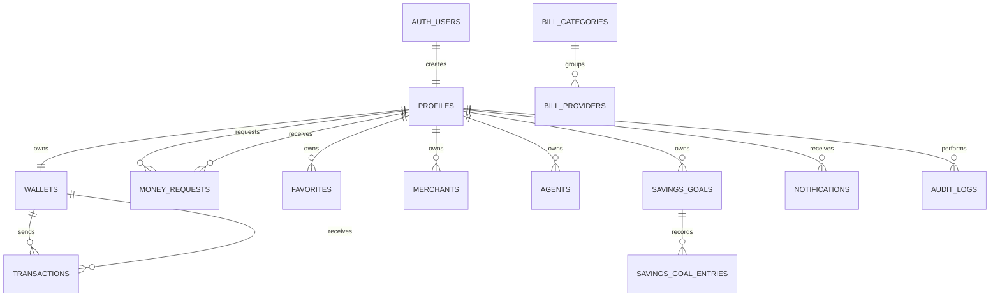

# Database Schema

NexaPay uses Supabase PostgreSQL for the real backend design. All balances and transactions are demo-only and represent fake educational currency.

## Migration Files

Run these files from Supabase **SQL Editor**:

1. `supabase/migrations/001_schema.sql`
2. `supabase/seed.sql`

For later secure transaction and RLS phases, also run:

3. `supabase/migrations/002_rpc_functions.sql`
4. `supabase/migrations/003_rls_policies.sql`

After you manually create demo Auth users, you may run:

5. `supabase/demo-seed-after-auth.sql`

## Core Tables

`profiles`

Stores one row per Supabase Auth user. Important columns:

- `id` references `auth.users(id)`
- `full_name`
- `email`
- `phone`
- `role`
- `account_status`

Constraints:

- Valid email format
- Valid demo phone format
- Role must be one of customer, merchant, agent, admin
- Email is normalized and indexed case-insensitively

`wallets`

Stores one demo wallet per profile.

- `user_id` references `profiles(id)`
- `balance` cannot be negative
- `currency` defaults to `BDT_DEMO`
- `status` supports active/frozen

`transactions`

Stores simulated ledger records.

- `transaction_id` is unique and human-readable
- `sender_wallet_id` references `wallets(id)`
- `receiver_wallet_id` references `wallets(id)`
- `amount` must be greater than zero
- `fee` cannot be negative
- `total_amount` must equal `amount + fee`
- At least one wallet must exist on every row
- Sender and receiver wallets cannot be the same
- `idempotency_key` prevents duplicate submissions

`money_requests`

Stores request-money workflows.

- `sender_id` references `profiles(id)`
- `receiver_id` references `profiles(id)`
- Sender and receiver cannot be the same
- Status supports pending, accepted, declined, cancelled
- `idempotency_key` prevents duplicate request submissions

`favorites`

Stores user-managed favorite contacts.

- `user_id` references `profiles(id)`
- `favorite_user_id` references `profiles(id)`
- Duplicate favorites are blocked
- A user cannot favorite themself
- `list_demo_favorites()` returns only the signed-in user's favorites with safe profile fields

## Role Tables

`merchants`

Stores merchant business metadata.

- `owner_id` references `profiles(id)`
- `merchant_code` is unique
- `qr_identifier` is unique and safe for QR use
- Trigger ensures the owner profile role is `merchant`

`agents`

Stores agent metadata.

- `user_id` references `profiles(id)`
- `agent_code` is unique
- Trigger ensures the linked profile role is `agent`
- Agent cash-in/cash-out balance movement uses dedicated RPC functions and audit logs

## Service Tables

- `service_categories`
- `recharge_operators`
- `bill_categories`
- `bill_providers`
- `banks`
- `donation_organizations`
- `promotions`
- `system_settings`

These tables let admins manage app content without editing HTML. Phase 17 uses them for service categories, recharge operators, bill categories, bill providers, demo banks, fictional donation organizations, promotional banners, and configurable demo settings.

## Savings Tables

`savings_goals`

Stores goal title, target amount, current amount, target date, and status.

`savings_goal_entries`

Stores the history of savings deposits, withdrawals, and adjustments.

## Notification And Audit Tables

`notifications`

Stores user-specific in-app alerts with read/unread state.

`audit_logs`

Stores sensitive admin/system actions. Admins should not silently rewrite completed transactions; corrections should create new auditable records.

`system_settings`

Stores configurable demo settings such as starting demo balance and demo limits. Admin changes are made through admin RPC logic and logged.

## Admin RPC Functions

Phase 17 and Phase 18 use admin-management functions:

- `admin_set_profile_status` updates `profiles.account_status` after checking the signed-in user is an active admin.
- `admin_set_managed_status` activates or suspends admin-managed rows such as merchants, agents, operators, providers, banks, donation organizations, and promotions.
- `admin_save_managed_item` creates or updates service content through audited admin logic.
- `admin_save_promotion` creates or updates promotional banners through audited admin logic.
- `admin_create_announcement` inserts in-app notifications for active users or a target role.
- `admin_update_system_setting` upserts rows in `system_settings`.

Each function writes an audit log entry. Completed transaction records remain view-only in the admin UI.

## Row Level Security Summary

Phase 18 makes `003_rls_policies.sql` the complete rerunnable RLS script.

- Anonymous direct table access is revoked.
- Users can read only their own wallet and related ledger rows.
- Users cannot directly insert, update, or delete wallet rows.
- Users cannot directly insert, update, or delete transaction rows.
- Money requests are created/responded to through RPC functions.
- Admins can read operational data through `public.is_admin()`.
- Admin writes for sensitive content use audited RPC functions.
- Merchant sensitive identity fields are protected by trigger.
- Notification content fields are protected by trigger.

## Storage Buckets

Phase 18 prepares private Supabase Storage buckets:

- `profile-images`
- `merchant-logos`

Policies require authenticated users and folder ownership. Profile images use a folder named with `auth.uid()`. Merchant logos use a folder named with the merchant ID owned by the signed-in merchant.

## Important Indexes

The schema includes indexes for:

- Profile role/status/email/phone lookup
- Wallet user lookup
- Transaction sender/receiver lookup
- Transaction type/status/date filtering
- Transaction metadata JSON search
- Money request sender/receiver/status filtering
- Favorite contact lookup
- Merchant/agent management
- Bill provider filtering
- Savings goal history
- Notifications by user and read state
- Promotions by status/date
- Audit logs by actor/entity

## Relationship Map

